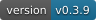
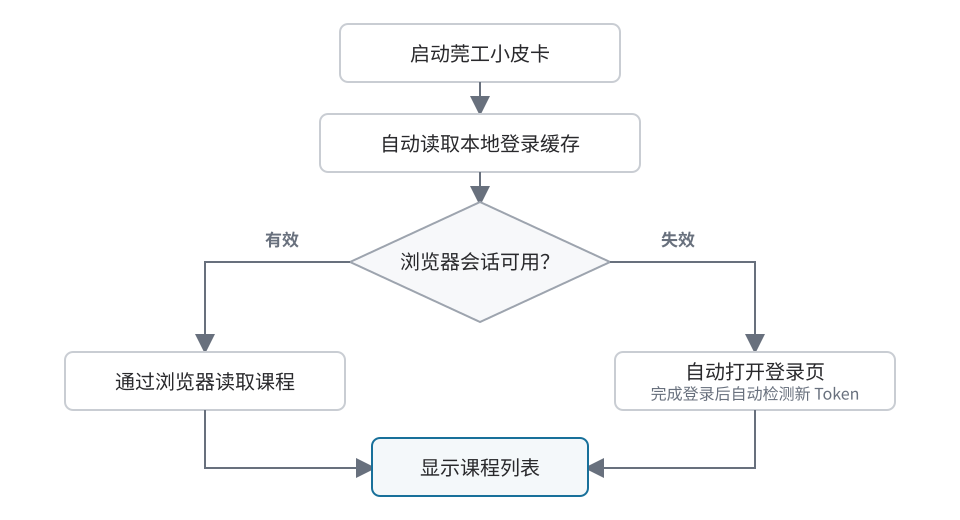
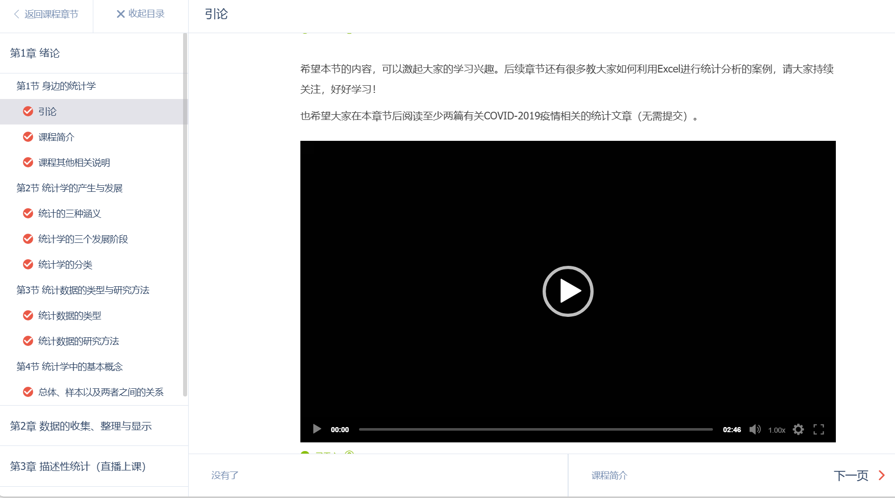

# dgut-bot

莞工小皮卡

[](https://www.python.org/) [](https://www.microsoft.com/windows/) []({{REPO_URL}}/releases) []({{REPO_URL}})

**莞工小皮卡**是一款主要由 `Python` 编写的优学院辅助程序，能够自动处理课程签到和课件学习任务。仅支持 Windows 系统。

> 不同的 Chromium 内核浏览器可能导致刷课功能异常，应优先使用谷歌 Chrome 或 Microsoft Edge 浏览器。

启动后先在终端检测浏览器；未找到时会弹出文件选择窗口，请选择浏览器的 `.exe` 文件（如 `msedge.exe` 或 `chrome.exe`）。取消选择后也可在终端粘贴程序路径或安装文件夹，按回车重新选择，输入 q 退出。确认有效后才打开网页。后续登录等操作务必在程序打开的浏览器进行，**不要新开另一个进程的浏览器**。网页设置中也可以修改浏览器路径。

## 课程签到

签到模块会读取课程、监测当天的课堂活动，并在发现支持的签到类型后自动尝试签到。目前支持数字码签到、一键签到，以及活动数据本身包含签到码的二维码签到。

### 1. 启动并完成登录

- 启动程序并进入课程签到模块。
- 程序会自动读取本机登录缓存，并通过调试浏览器中对应的学校页面请求课程和签到接口。
- 如果缺少请求所需的同源页面，程序会先把缓存 Token 恢复为仅供 `.dgut.edu.cn` 使用的安全浏览器 Cookie，再在后台自动创建页面；缓存有效时无需重新登录即可显示课程列表。
- 只有服务端明确拒绝缓存身份，或浏览器会话无法恢复时，程序才会准备登录页。
- 如果出现登录页，请在程序打开的独立浏览器中完成登录；检测到登录状态后，程序会自动显示课程列表。
- 浏览器中的 Cookie 只作为候选登录信息；程序成功读取课程后才会更新本地缓存。若候选 Cookie 已失效并返回登录重定向或 HTTP 401，程序会丢弃失效缓存，并等待浏览器产生新的登录信息，不会反复显示假成功或重复请求同一凭据。

课程列表由 `lms.dgut.edu.cn` 页面发出，课堂、活动和签到请求由 `application.dgut.edu.cn` 页面发出。程序会自动选择与接口同源的标签页，以复用浏览器登录状态和网络连接；不会从 Python 静默改成直连接口。



> 登录提示：请始终在程序打开的浏览器中登录。日常使用的其它浏览器与程序的登录状态并不共用。签到监测期间请勿关闭程序打开的 LMS/Application 学校页面；这些页面可以留在后台，不会抢占系统鼠标。

### 2. 选择签到课程

- 在输入框中输入课程名称、教师名称或课程 ID 进行搜索。
- 使用上下方向键或滚轮移动选项，按 `Enter` 确认；也可以直接用鼠标点击课程。
- 课程列表沿签到事件流向右缩进一级，每门课程通过分支线连接主线；绿色节点表示当前键盘或鼠标选中的课程。
- 确认课程后，再按 `Enter` 开始监测当天的签到活动。

### 3. 查看签到结果

开始监测后，程序默认每 5 秒通过浏览器检查一次。页面不会为每一轮检查重复新增日志：事件流末尾的“持续监测”节点会原地更新当前轮次、最近结果和下次检查倒计时，页面底部状态栏会同步显示所选课程、运行状态和检查次数。相同的“今日暂无课堂”或“暂未发现签到”只保留一条，避免长时间运行后刷屏。

签到成功、重复签到、跳过原因、登录失效和错误等关键变化会作为独立节点加入事件流。如果缺少对应学校页面、浏览器被关闭或登录状态失效，本轮请求会明确失败，不会退回 Python 直连。搜索输入、课程列表和监测状态都通过节点与主时间线连接，表示它们属于同一条签到流程。

- 输入 `/` 或 `stop`：停止当前监测。
- 停止后再次输入 `/`：返回课程列表。
- 输入 `clear`：清空当前页面上的签到事件记录，不影响已经保存到文件的签到日志。
- 签到记录：保存在设置中指定的日志位置。

> 二维码签到：只有活动数据本身包含签到码时才能处理；程序不会识别教室现场展示的二维码图片。

## 课件学习

刷课模块用于辅助处理课件中的视频、文档、章节切换和提示弹窗。进入模块后，程序会在登录有效时自动扫描当前课程中的未完成课件；扫描结果在本次运行内缓存约 5 分钟，短时间切换页面不会重复请求。

- 在“未完成课件”区域可按课程名、章节名或课件名搜索，使用鼠标或 `↑` / `↓` 与 `Enter` 选择一个课件。
- 选择后程序会复用程序管理的优学院课件标签页，依次显示“正在打开、等待页面加载、正在校验、正在启动”等状态；只有 URL、页面结构和课件标识校验通过后，才会调用现有刷课控制器一次。
- 某门课程扫描失败不会阻止其它课程；可展开失败详情并点击“重新扫描”。扫描中可以取消，明确刷新会绕过五分钟缓存。
- 第一版只支持一次选择并启动一个课件，不支持批量选择或连续自动刷完全部课程。

如果目录响应暂未提供可验证的真实课件地址，或自动打开失败，仍可使用原有手动方式：

- 使用程序启动的 Chromium 浏览器登录优学院。
- 进入课程并打开需要学习的具体课件页面。
- 确认页面地址中包含 `ua.dgut.edu.cn/learnCourse`。
- 如果启用了自动答题，程序会优先使用本地登录缓存直接连接课程 AI，无需另开 AI 工作台；缓存不可用时才退回浏览器中的课程 AI 上下文。



- 然后返回程序的刷课模块，按 `Enter` 或输入 `start` 启动。

### 常用命令

| 命令 | 作用 |
| --- | --- |
| `Enter` / `start` | 启动课件学习辅助 |
| `open` | 打开优学院课件网站 |
| `speed 8` | 把视频倍速调整为 8×，支持 1–16 |
| `stop` / `/` | 停止当前刷课任务 |
| `clear` | 清空当前模块内容 |

### 查看运行状态

运行期间，状态区域会显示当前课程、课件页面、视频进度、任务计划、重试次数和停滞状态。课件页面可以留在后台，程序会继续处理已连接的页面。

### 自动答题

自动答题默认关闭，需要在设置 → 刷课中为本次运行明确启用。开启总开关后，可以分别启用选择题、判断题和填空题。成功启动一次刷课任务后，总开关会立即恢复为关闭；当前任务仍按启动时的选择运行，下次启动则需要重新开启。启动失败不会消耗这次选择，程序重启也不会继承上一次的开启状态。

程序会把当前页面的一份测验的纯文本题干和选项交给课程 AI，严格校验返回格式后再填写并提交。当前测验处理结束前不会并发启动另一份测验，也不会自动翻页。AI 桥接操作全局串行，相邻两次上游操作在上一轮结束后至少间隔 5 秒。题目中的图片和公式暂不传给 AI；运行日志会提示这类信息缺失。

程序内的独立 AI 工作台提供模型选择，下拉列表来自优学院当前启用的模型；选择会自动保存，并同时作为刷课自动答题使用的模型。只要程序已用有效登录缓存读取课程，独立工作台无需打开优学院即可直接使用。

> AI 请求或答案格式连续两次失败，以及遇到尚不支持的题型时，程序会在触碰页面前退回旧规则：选择题选择 `C`，判断题选择“错误”，填空题填写 `,`。页面填写开始后若出现错误，程序会停止在当前页，不会改用另一套答案或重复提交。

> 课程 AI 请求、测验提交和签到操作都可能由学校或平台记录。刷课只对已经校验的页面操作加入有限的鼠标轨迹和短停顿，不会随机乱点、随机按键或伪造无意义活动；课程与签到接口使用真实 Chromium 页面请求，但这些措施都不能保证自动化行为不可识别。请遵守学校规定、课程要求和平台规则。

## 设置与数据

### 浏览器

用于选择程序连接的 Chromium 浏览器。通常保持自动检测即可；只有自动检测失败时才需要填写浏览器路径。

### 校园网

启用“开机时打开校园网登录页”并保存设置后，程序会在当前用户的 `HKCU\Software\Microsoft\Windows\CurrentVersion\Run` 中创建 `DgutBotCampusLogin` 启动项；关闭开关并保存后会移除该项。进入桌面后，它会立即使用默认浏览器打开 `https://login.dgut.edu.cn/eportal/index.jsp`。该功能不等待网络、不判断当前是否已联网，也不保存校园网账号、密码或带有当前 IP、设备及接入点参数的动态链接；若浏览器打开早于 Wi-Fi 就绪，请在联网后刷新页面。

### 账号登录恢复

学号和密码输入框目前已经锁定，暂时不能编辑。账号密码自动登录功能尚未开放；现阶段登录缓存失效后，会打开登录页并等待用户在程序浏览器中完成登录。

### 日志设置

可以控制是否保存签到与错误详情，也可以修改签到日志的保存位置。相对路径以用户数据目录为基准。

### 本地数据

| 文件或目录 | 用途 |
| --- | --- |
| `config.json` | 保存浏览器、签到日志和刷课设置；自动答题开启状态除外 |
| `auth.json` | 保存 Token 和用户 ID 缓存 |
| `browser_profile/` | 保存独立浏览器配置和登录状态 |
| `签到记录.md` | 保存签到结果与错误详情 |
| 注册表 `DgutBotCampusLogin` | 可选的当前用户校园网登录页开机启动项 |

程序的本地服务只监听 `127.0.0.1`；发行版端口范围为 `8765–8784`，开发前端为 `1420–1439`。签到日志会自动隐藏常见的 `Token`、`Authorization`、`Password`、`Cookie` 和 `Bearer` 凭据。

## 更新

小皮卡通过 Velopack 从 GitHub 检查更新。若更新失败或速度较慢，请开启支持 GitHub 的网络加速器；首次安装器也可从 [Gitee 下载页](https://gitee.com/swccq23/dgut-bot/releases) 获取。

---

## 关于项目

莞工小皮卡 v{{VERSION}} 是非官方个人项目，与学校及优学院平台没有官方关联。请遵守学校规定、课程要求和平台规则。

本项目采用 [MIT License]({{REPO_URL}}/blob/main/LICENSE) 开源，使用、修改或分发时请保留原版权声明和许可证声明。如需反馈问题或提建议，请通过 GitHub Issues 提交。

[在 GitHub 查看项目]({{REPO_URL}})

## 开发环境与本地运行

项目后端使用 Python，前端使用 React、TypeScript 和 Vite。推荐使用 Python 3.10+ 与 Node.js 20+。

```powershell
git clone https://github.com/23swccp/dgut-bot.git
Set-Location .\dgut-bot
python -m pip install -r .\requirements.txt pytest "pyinstaller==6.22.2"
Set-Location .\web
npm ci
Set-Location ..
.\启动浏览器版.bat
```

### 维护抓包脚本

`yxy_capture_fixed.py` 仅供本机协议调查使用。开始抓包后，它默认每 120 秒（2 分钟）刷新一次东莞理工/优学院页面，以兼顾长时间监听和日志噪声；将脚本中的 `AUTO_REFRESH_INTERVAL` 设为 `0` 可关闭自动刷新。脚本及其生成的桌面日志可能包含 Cookie、Token、用户和课程信息，不得提交或公开分享。

## 项目结构

| 路径 | 用途 |
| --- | --- |
| `src/dgutbot/app/` | 程序入口、浏览器、HTTP、更新与本机集成 |
| `src/dgutbot/domain/` | 登录缓存、浏览器请求桥、课程、签到和应用设置 |
| `src/dgutbot/course/` | 课件状态机、视频、文档、PPT 与测验 |
| `src/dgutbot/agent/` | Agent JSON CLI、协议、运行时和任务 |
| `tests/` | 全部离线回归测试 |
| `tools/` | 本地模拟和诊断工具，不进入发行包 |
| `web/` | React 前端和内置图片 |
| `scripts/`、`packaging/` | 构建、发布和 PyInstaller 配置 |

## 测试与模拟环境

```powershell
python -m pytest -q
cd web
npm test -- --run
npm run build
```

没有真实课件时，可运行：

```powershell
python tools/quiz_simulator.py
```

验证完整 Agent/CLI 测验流程（真实浏览器、本地合成课件、提交保存和故障场景）：

```powershell
python tools/course_lab.py
```

浏览器矩阵、重复运行、失败报告与覆盖边界见 [课件测试环境](课件测试环境.md)。

真实课件结构校准使用 `python tools/quiz_probe.py`：只读观察 iframe、操作前后状态和脱敏接口结构，详见 [课件采样说明](课件采样说明.md)。

发布、自动更新和 Gitee 镜像规则见 `发布与更新维护.md`；当前代码维护地图见 `交接文档.md`。
